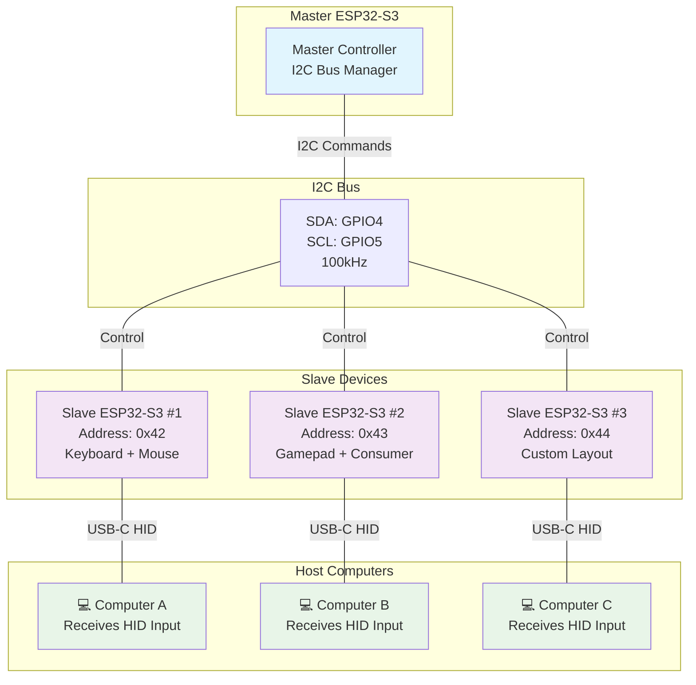

# HIDra - Multi-headed I2C-controlled USB HID System

[](https://www.gnu.org/licenses/gpl-3.0)
[](https://github.com/espressif/esp-idf)
[](https://www.espressif.com/en/products/socs/esp32-s3)
[](#building)
[](#code-quality)
[](https://conventionalcommits.org)
[](https://hannover.de)
[](https://claude.ai)

> ⚠️ **EXPERIMENTAL SOFTWARE** - This project is in experimental state. Use at your own risk. Not recommended for production environments.

**ESP32-S3 firmware enabling a single Master to control multiple Slave devices over I2C, with each slave acting as a dynamically configurable composite USB HID device.**

---

## 🏗️ System Architecture



## 🚀 Key Features

### ✨ **Professional Architecture**
- **Decoupled Design**: Master component coexists with other I2C peripherals
- **Clean API**: Reusable component with clear separation of concerns
- **Error Handling**: Comprehensive status reporting and error detection
- **Memory Management**: Proper cleanup and resource management

### 🔧 **Dynamic Configuration**
- **USB Identity**: VID, PID, manufacturer, product, serial configurable via I2C
- **Composite Layout**: Enable/disable HID interfaces (keyboard, mouse, gamepad, etc.)
- **I2C Address**: Configurable slave address with bulletproof provisioning
- **NVS Persistence**: All configuration persisted across reboots

### 🛡️ **Robust Communication**
- **FreeRTOS Tasks**: Decoupled I2C and USB handling prevents timeouts
- **Queue System**: Buffered HID report handling
- **Status Register**: Real-time error reporting and command acknowledgment
- **Protocol Validation**: Input validation and error detection

### 🎮 **USB HID Support**
- **Dynamic Descriptors**: USB descriptors built at boot from NVS configuration
- **Multiple Interfaces**: Keyboard, Mouse, Gamepad, Consumer Control support
- **Standard Compliance**: Full USB HID specification compliance
- **TinyUSB Integration**: Modern USB stack with callback system

---

## 📋 Protocol Specification

### I2C Register Map

| Register | Type | Description | Payload |
|----------|------|-------------|---------|
| **HID Data Registers** ||||
| `0x16` | Write | Keyboard HID reports | 8 bytes (standard keyboard report) |
| `0x12` | Write | Mouse HID reports | 4 bytes (buttons, x, y, wheel) |
| `0x15` | Write | Gamepad HID reports | 6 bytes (buttons, axes) |
| `0xC1` | Write | Consumer Control reports | 2 bytes (media keys) |
| **Configuration Registers** ||||
| `0xF0` | Write | USB VID/PID configuration | 4 bytes: [VID_LSB, VID_MSB, PID_LSB, PID_MSB] |
| `0xF1` | Write | USB manufacturer string | Variable length, null-terminated UTF-8 (max 63 chars) |
| `0xF2` | Write | USB product string | Variable length, null-terminated UTF-8 (max 63 chars) |
| `0xF3` | Write | USB serial string | Variable length, null-terminated UTF-8 (max 63 chars) |
| `0xF4` | Write | Composite device layout | 2 bytes (uint16_t): bitmap of enabled HID interfaces |
| `0xFE` | Write | I2C address configuration | 1 byte: new 7-bit I2C slave address |
| **Status Register** ||||
| `0xFF` | Read | Device status | 1 byte: bitmask of internal state |

### Status Register Bits

| Bit | Value | Name | Description |
|-----|-------|------|-------------|
| 0 | `0x01` | `STATUS_OK` | Last command successful (cleared on read) |
| 1 | `0x02` | `ERROR_UNKNOWN_REGISTER` | Write to undefined register |
| 2 | `0x04` | `ERROR_PAYLOAD_TOO_LARGE` | More data than expected |
| 3 | `0x08` | `ERROR_INTERFACE_DISABLED` | HID report for disabled interface |
| 4 | `0x10` | `ERROR_NVS_WRITE_FAILED` | Failed to save config to NVS |

### Default Configuration

| Parameter | Default Value | Description |
|-----------|---------------|-------------|
| I2C Address | `0x70` | Initial provisioning address |
| USB VID | `0x413D` | Vendor ID |
| USB PID | `0x0001` | Product ID |
| Manufacturer | `"HIDra Project"` | USB manufacturer string |
| Product | `"HIDra Composite HID"` | USB product string |
| Serial | Generated from MAC | Unique serial number |
| Layout | `0x000B` | Keyboard + Mouse + Gamepad |

---

## 🛠️ Building and Installation

### Prerequisites

- **ESP-IDF v5.5** - [Installation Guide](https://docs.espressif.com/projects/esp-idf/en/v5.5/esp32/get-started/index.html)
- **Node.js** - For development tools and pre-commit hooks
- **clang-format** - For code formatting
- **cppcheck** - For static analysis

### Quick Start

```bash
# Clone the repository
git clone https://github.com/LoRaCue/HIDra.git
cd HIDra

# Setup development environment
make setup-env

# Set target (first time only)
make set-target

# Build, flash, and monitor
make dev
```

### Available Commands

```bash
# Build System
make build         # Build firmware
make clean         # Clean build artifacts
make flash         # Flash to device
make monitor       # Monitor serial output
make dev           # Build, flash, and monitor

# Code Quality
make format        # Format code with clang-format
make format-check  # Check code formatting
make lint          # Run static analysis with cppcheck
make test          # Build and validate unit tests

# Development
make setup-env     # Setup development environment
make set-target    # Set target to ESP32-S3
make env-info      # Show environment information
```

---

## 🧪 Testing

### Unit Tests

The project includes comprehensive unit tests covering:

- Protocol constants and register mappings
- Master component API validation
- USB descriptor building and management
- Configuration management and NVS operations
- I2C protocol compliance
- Status register operations
- HID report handling

```bash
# Run unit tests
make test

# Manual testing on hardware
cd tests/unit
idf.py flash monitor
```

### Hardware Testing

```bash
# Test with Python harness (requires USB-to-I2C adapter)
cd tests/harness
python3 test_hidra_slave.py
```

---

## 📖 Usage Examples

### Master Application

```c
#include "hidra.h"

void app_main(void) {
    // Initialize I2C bus
    hidra_bus_handle_t bus;
    hidra_master_bus_init(I2C_NUM_0, GPIO_NUM_4, GPIO_NUM_5, &bus);
    
    // Add device at default address
    hidra_device_handle_t device;
    hidra_add_device_to_bus(bus, 0x70, &device);
    
    // Send keyboard report (press 'A' key)
    uint8_t kbd_report[8] = {0, 0, 0x04, 0, 0, 0, 0, 0};
    hidra_send_generic_report(device, HIDRA_REG_KEYBOARD, kbd_report, 8, 1000);
    
    // Check command status
    uint8_t status;
    hidra_read_status(device, &status, 1000);
    if (status & STATUS_OK) {
        printf("Command successful!\n");
    }
    
    // Reconfigure device to new address
    hidra_reconfigure_address(&device, 0x42, 1000);
}
```

### Provisioning Workflow

⚠️ **IMPORTANT**: Use one-by-one provisioning to avoid I2C address collisions:

1. Connect **ONE** unconfigured slave (default address `0x70`)
2. Master assigns unique address (e.g., `0x42`)
3. Slave saves address to NVS and reboots
4. Connect **NEXT** unconfigured slave and repeat

```c
// Example provisioning sequence
hidra_device_handle_t device;
hidra_add_device_to_bus(bus, 0x70, &device);  // Default address

// Configure device
hidra_set_usb_ids(device, 0x1234, 0x5678, 1000);
hidra_set_usb_string(device, CONFIG_MANUFACTURER_STR_REG, "My Company", 1000);
hidra_set_composite_device_config(device, LAYOUT_KEYBOARD | LAYOUT_MOUSE, 1000);

// Change address (device will reboot)
hidra_reconfigure_address(&device, 0x42, 1000);
```

---

## 🏗️ Project Structure

```
HIDra/
├── firmware/                   # ESP-IDF Slave Firmware
│   ├── main/
│   │   ├── main.c             # Main application with FreeRTOS tasks
│   │   ├── usb_descriptors.h  # USB descriptor system interface
│   │   └── usb_descriptors.c  # Dynamic descriptor builder
│   ├── CMakeLists.txt
│   └── sdkconfig.defaults
│
├── libs/hidra/                 # Master Component Library
│   ├── hidra.h               # Public API interface
│   ├── hidra.c               # Implementation
│   └── CMakeLists.txt
│
├── protocol/                   # Shared Protocol Definition
│   └── hidra_protocol.h      # Single source of truth for constants
│
├── examples/master_test_app/   # Example Master Application
│   └── main/main.c           # Demonstrates complete usage workflow
│
├── tests/                      # Comprehensive Test Suite
│   ├── unit/                 # Unity-based unit tests
│   └── harness/              # Python hardware validation
│
├── docs/                       # Documentation
│   └── blueprint.md          # Original system design
│
├── .husky/                     # Git hooks for code quality
├── .github/                    # GitHub workflows (future)
├── Makefile                    # Build system with ESP-IDF integration
└── package.json               # Node.js dependencies for tooling
```

---

## 🔧 Code Quality

### Pre-commit Hooks

The project uses Husky for automated code quality checks:

- **Code Formatting**: Enforced via clang-format
- **Conventional Commits**: Commit message validation
- **Static Analysis**: cppcheck integration

### Coding Standards

- **C17 Standard** with ESP-IDF extensions
- **clang-format** for consistent formatting
- **Conventional Commits** for clear change history
- **Comprehensive Documentation** for all public APIs

---

## 🤝 Contributing

1. **Fork** the repository
2. **Create** a feature branch (`git checkout -b feature/amazing-feature`)
3. **Commit** changes using conventional commits (`git commit -m 'feat: add amazing feature'`)
4. **Push** to the branch (`git push origin feature/amazing-feature`)
5. **Open** a Pull Request

### Development Workflow

```bash
# Setup development environment
make setup-env
npm install

# Make changes and test
make format        # Format code
make lint          # Run static analysis
make test          # Run unit tests
make build         # Build firmware

# Commit (pre-commit hooks will run automatically)
git add .
git commit -m "feat: add new feature"
```

---

## 📄 License

This project is licensed under the **GNU General Public License v3.0** - see the [LICENSE](LICENSE) file for details.

---

## ⚠️ Disclaimer

**This software is experimental and provided "as is" without warranty of any kind.** Use at your own risk. The authors are not responsible for any damage or data loss that may occur from using this software.

---

## 🔗 Related Projects

This firmware and library is part of the **LoRaCue** ecosystem:

- **Main Repository**: [github.com/LoRaCue/HIDra](https://github.com/LoRaCue/HIDra)
- **LoRaCue Project**: Advanced wireless communication solutions

---

## 📞 Support

- **Issues**: [GitHub Issues](https://github.com/LoRaCue/HIDra/issues)
- **Discussions**: [GitHub Discussions](https://github.com/LoRaCue/HIDra/discussions)
- **Documentation**: [Project Wiki](https://github.com/LoRaCue/HIDra/wiki)

---

<div align="center">

**Made with ❤️ in Hannover, Germany**

[](https://www.espressif.com/en/products/socs/esp32-s3)
[](https://github.com/espressif/esp-idf)

</div>
